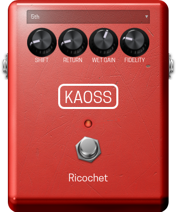

# Ricochet – LV2 Pitch Shifter

**A versatile pitch-shifting LV2 plugin, inspired by the DigiTech Whammy Ricochet^ and optimized for the MOD Audio platform.**

<p align="center">
  
</p>

---

## Features

*  Shifts pitch across a wide range: -24 semitones .. +24 semitones.
*  Momentary and latching operation modes to support footswitch-style performance.
*  Adjustable shift and return times for smooth or fast glides.
*  Clean (dry) blend option and separate wet level control.
*  Selectable sweep direction and a variety of musical intervals (2nd, 4th, 5th, Octave, etc.).
*  Fidelity presets (Lo-Fi, Hi-Fi, Ultra, etc.) trade performance for quality.
*  True Bypass option to bypass processing entirely when there is no pitch shifting happening.

---

## Controls Usage

* "Trigger" engages or disengages the pitch shift effect.
* "Interval" selects the target pitch step (2nd, 4th, 5th, Octave, etc.) and "Direction" toggles whether that sweep goes up or down.
* "Shift Time" and "Return Time" define how fast the pitch glides to and from the target when the trigger engages or releases.
* "Mode" selects momentary vs latching behaviour.
* "Clean" mixes dry signal into the output (enabled automatically for certain intervals) and "Gain" controls the wet level only.
* "Fidelity" adjusts the algorithm's tradeoff between audio quality and CPU usage, with Lo-Fi → Hi-Fi → Ultra → Insane presets.
* "True Bypass" toggles direct routing of the input to output when the Trigger is off, eliminating latency at the expense of glitchier transitions.

---

## Installation

For most users, it is recommended to download the pre-built plugin from the **[Releases Page](https://github.com/theKAOSSphere/ricochet/releases)**.

1.  Go to the [Releases Page](https://github.com/theKAOSSphere/ricochet/releases).
2.  Download the latest `ricochet.lv2-vx.x.tgz` file.
3.  Unzip the file. You will have a folder named `ricochet.lv2`.

### For MOD Audio Devices

1.  **Transfer the Plugin:** Copy the entire `ricochet.lv2` directory from your computer to your MOD Audio device. You can use `scp` for this:
  ```bash
  # Example from your Downloads folder
  scp -r ~/Downloads/ricochet.lv2 root@192.168.51.1:/data/plugins/
  ```
2.  **Restart the Host:** Connect to your device via `ssh` and restart the `mod-host` service:
  ```bash
  ssh root@192.168.51.1
  systemctl restart mod-host
  ```
3.  **Refresh the Web UI:** Reload the MOD web interface in your browser. Ricochet should now be available.

### For Linux Desktops

1.  **Copy the LV2 Bundle:** Copy the `ricochet.lv2` folder to your user's LV2 directory.
  ```bash
  cp -r ~/Downloads/ricochet.lv2 ~/.lv2/
  ```
2.  **Scan for Plugins:** Your LV2 host (e.g., Ardour, Carla) should automatically detect the new plugin on its next scan. If it doesn't appear, check your host's plugin scan options or manually rescan.

---

## Building From Source

<details>
<summary><strong>► Build for MOD Audio Devices (using mod-plugin-builder)</strong></summary>

This project is configured to be built using the **`mod-plugin-builder`** toolchain. For more details on setting up the MOD Plugin Builder, please refer to the [mod-plugin-builder](https://github.com/mod-audio/mod-plugin-builder) repository.

#### Prerequisites

1.  A functional **MOD Plugin Builder** environment.
2.  The necessary build dependencies (e.g., `libtool`, `pkg-config`) are handled by the buildroot environment.

#### Build Steps

1.  **Clone the Repository:** Place the `ricochet` repository inside the `plugins/package` directory of your `mod-plugin-builder` folder.
  ```bash
  cd /path/to/mod-plugin-builder/plugins/package
  git clone https://github.com/theKAOSSphere/ricochet
  ```
2.  **Run the Build:** Navigate to the root of the `mod-plugin-builder` and run the build command, targeting `ricochet`.
  ```bash
  cd /path/to/mod-plugin-builder
  ./build <target> ricochet
  ```
  Replace `<target>` with your device target (e.g., `modduox-new`). The compiled bundle will be located in the `/path/to/mod-workdir/<target>/target/usr/local/lib/lv2` directory. You can then follow the installation instructions to transfer it to your device.

</details>

<details>
<summary><strong>► Build for Linux Desktop (Standalone)</strong></summary>

For testing on a standard Linux desktop without the MOD toolchain.

### Prerequisites

Install the necessary build tools and libraries (e.g., on Debian/Ubuntu):
```bash
sudo apt-get update
sudo apt-get install build-essential libtool pkg-config lv2-dev
```

### Build Steps

1.  **Navigate to the Source Directory:**
  ```bash
  cd source/
  ```
2.  **Compile the Plugin:**
  ```bash
  make
  ```
  A `ricochet.lv2` bundle will be created inside the `source/` directory. You can then follow the desktop installation instructions to copy it to `/path/to/lv2/directory/`.

</details>


---

## Credits and License

*  **Original Base:** This project is based on the MOD Audio pitch-shifting plugins: https://github.com/mod-audio/mod-pitchshifter
*  **Inspiration:** Inspired by the DigiTech Whammy Ricochet^.
*   **Ricochet Emulation & MODGUI:** Modification of the source to emulate the Ricochet hardware and development of the MODGUI by **KAOSS**.

(^) 'Other product names modeled in this software are trademarks of their respective companies that do not endorse and are not associated or affiliated with me. Digitech Whammy is a trademark or trade name of another manufacturer and was used merely to identify the product whose sound was reviewed in the creation of this product. All other trademarks are the property of their respective holders.'
